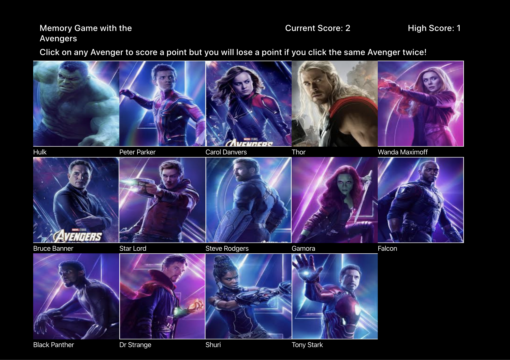
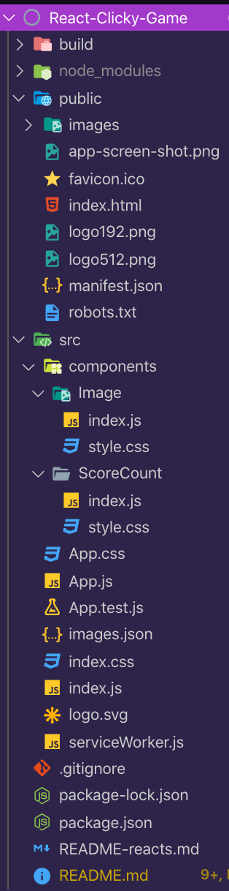

# React-Clicky-Game

An application built with React

## App Screen-Shots:


# Link to full app demo on GitHub Pages:
https://olisun.github.io/React-Clicky-Game/


## About the project:
We have to create a React Memory Game with click functions and methods to track current score and high score. The user scores a point each time they click on an image for the first time, however, if they click on the same image twice, the score resets to 0. The object of the game is to not click on an image more than once. The images are shuffled after each click so the user has to remember the image they clicked. The high score is tracked and automatically updates.

## User Guide:

1. Click any image but remember what you clicked.
2. The images will shuffle after each click.
3. Users score a point for each image clicked the first time.
4. Once the user clicks on an image for the second time, the game resets and the score goes back to zero. 
5. How many first images can you click in a row?


## MVP Objectives:

  * The application should render different images (of your choice) to the screen. Each image should listen for click events.

  * The application should keep track of the user's score. The user's score should be incremented when clicking an image for the first time. The user's score should be reset to 0 if they click the same image more than once.

  * Every time an image is clicked, the images rendered to the page should shuffle themselves in a random order.

  * Once the user's score is reset after an incorrect guess, the game should restart.

## Stretch Goals:

  
## Techology Stack:
  * React
  * React-BootStrap
  * Create-React-App
  * BootStrap
  * Javascript
  * JSX


## Methodology:

I followed the class activities in React. Helpful activities included Basic State (17-react # 27) and Friends Refactor (17-react # 29). They basically allowed me to reverse-engineer the logic needed to set the state for the different variables (images, score, highScore, Alert and Wins)

I created an images.json to store an array of objects so that I can map those objects onto the DOM in App.js using array.map(). I also remembered we did an in-class activity writing code to shuffle a deck of cards. I applied the shuffle function to this app to shuffle the array of characters from images.json.

## Problems Overcome:

Writing logic so that the app knows what to do when an image is clicked once but not twice. I practiced my Google-Foo and used indexOf() to keep track of the clicked images. The code snippet and comments are below.

## Problems Still Facing.

Images are not rendering on the deployed site. They are locally.

## Code Snippets:
Handling the clicked images.
```
 // if the clicked image is clicked and it's not found in the array (what the "===-1" states), then push the image id into the clickedImages array. increment the score and run the shuffle function. 
    if (clickedImages.indexOf(id) === -1) {
      clickedImages.push(id);
      console.log(clickedImages);
      this.handleIncrement();
      this.shuffleImages();
    } else if (this.state.score === 10) {
      this.setState({
        showWins: 1,
        score: 0,
        clickedImages : []
      });
    // if the user clicks the same image again, since it's already in the array (from the previous click), the score is reset to 0.
    } else {
      this.setState({
        score: 0,
        clickedImages: []
      });
      // this shows the "Oops" message defined below
      this.setState({
        showAlert: 1
      });
    };
```
Shuffling the images
```
// Function for shuffling the array of images defined in images.json (applied from shuffling a deck of cards from class). 
 const shuffle = array => {
  for (let i = array.length - 1; i >= 0; i--) {
    const randIndex = Math.floor(Math.random() * (i + 1));
    [array[i], array[randIndex]] = [array[randIndex], array[i]]
  }
  return array;
}

  // Calling the shuffle function defined above. 
  shuffleImages = () => {
    this.setState({
      images: shuffle(images)
    });
  };
```
## File Structure Screen-Shot:



## Link to Portfolio Page:
https://olis-portfolio.herokuapp.com/

## You can also reach me on LinkedIn:
https://www.linkedin.com/in/oliver-sun-4b6baba/

